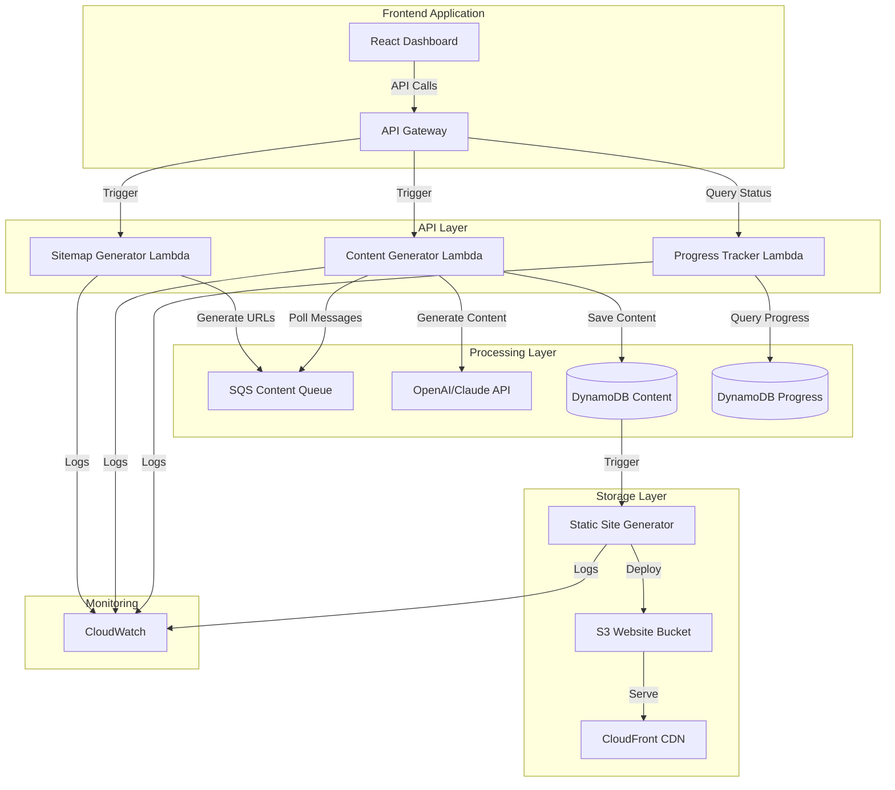

# Local SEO Website Generator

A serverless application for generating SEO-optimized websites using AWS Lambda, ChatGPT, and React.

## Architecture

- Frontend: React/TypeScript dashboard with Tailwind CSS and shadcn/ui
- Backend: AWS Lambda functions in Python 3.x
- API Layer: AWS API Gateway
- Storage: AWS DynamoDB for webpage content
- Hosting: AWS S3 Static Website Hosting
- AI: OpenAI ChatGPT API & Anthropic Claude for content generation
- CDN: AWS CloudFront distribution for the AWS S3 static website

## Features

- 🏢 Business profile management
- 📍 Service area list management
- 🏢 Business service list management
- 🗺️ Generate local seo webpages sitemap
- 📑 Track progress of AI web content generation.
- 📱 Responsive management dashboard UI
- 🤖 AI content generation with either ChatGPT or Claude. The user can select.
- 📑 Save content generation progress into DynamoDB table

## Tech Stack

### Frontend

- React 18
- TypeScript
- Tailwind CSS
- shadcn/ui
- Webpack 5
- AWS S3 static website hosting

### Backend

- Python 3.10+
- AWS Lambda
- AWS API Gateway
- AWS DynamoDB
- OpenAI GPT API
- Anthropic Claude API

## Getting Started

### Prerequisites

- Node.js 18+
- Python 3.10+
- AWS CLI configured
- OpenAI API key
- Anthropic API key

## Dynamodb Tables

### Business Profile Table

- Business Profile Table = mb_business_details_table = arn:aws:dynamodb:us-east-1:752567131183:table/mb_business_details_table

### Client Webpage Content Tables

This has a list of clients and DynamoDB table pairings.

- [Client Name] = [DynamoDB Table Name]

- JC Law = localseo-jc-law
- MarketBrewer = localseo-marketbrewer
- SLS Dispensary = localseo-streetlawyerservices
- Weed In DC = localseo-weed-in-dc
- Best DC Dispensary = localseo-best-washington-dc-dispensary
- Arcand Wigglers = local-seo-arcands-wigglers

## Folder Structure

- local-seo-generator/
  - .babelrc
  - .DS_Store
  - .env
  - .gitignore
  - .vscode/
    - settings.json
  - jsconfig.json
  - package-lock.json
  - package.json
  - postcss.config.cjs
  - public/
    - index.html
  - README.md
  - src/
    - .DS_Store
    - components/
      - dashboard/
        - Dashboard.tsx
        - DashboardLayout.tsx
        - Header.tsx
        - Sidebar.tsx
        - BusinessProfile.tsx
        - index.ts
        - ServiceAreas.tsx
        - BusinessService.tsx
      - ui/
        - Button.tsx
        - Card.tsx
        - ProgressBar.tsx
        - ScrollArea.tsx
        - Select.tsx
        - Table.tsx
        - Toast.tsx
        - UseToast.tsx
        - index.ts
        - Input.tsx
      - contexts
        - BusinessContext.tsx
      - docs
        - business-profile-schema.md
        - dynamodb-schema-mb-webpage-content.md
        - dynamodb-schema-mb-business-profiles.md
        - sqs.md
      - App.tsx
    - index.tsx
    - lib/
      - api.ts
      - utils.ts
    - styles/
      - globals.css
    - types/
      - dotenv-webpack.d.ts
      - global.d.ts
  - tailwind.config.cjs
  - tsconfig.json
  - tsconfig.node.json
  - webpack/
    - webpack.common.ts
    - webpack.dev.ts
    - webpack.prod.ts

## Developer Notes To Code

- There could 50,000 webpages in queue to be generated. The dashboard will update once a webpage has been completed generated with AI LLM and saved into DynamoDB.
- The dashboard will show a list of all the urls to be generated in a nice UI fashion.
- The dashboard will show the URL and content of the last completed generation.

## Data Structure Diagram

 

 

## AWS Infrastructure Setup

To build the AWS infrastructure for the Local SEO Website Generator project, you will need to set up the following services and ensure proper connectivity between them:

### Services to Build

1. **Amazon S3**

   - Purpose: Host the static website (React dashboard)
   - Configuration: Enable static website hosting

2. **Amazon CloudFront**

   - Purpose: Distribute the static website globally
   - Configuration: Set the S3 bucket as the origin

3. **AWS Lambda**

   - Purpose: Backend processing
   - Functions:
     - Sitemap Generator Lambda
     - Content Generator Lambda
     - Progress Tracker Lambda
   - Configuration: Ensure each Lambda function has the necessary IAM roles and permissions

4. **Amazon API Gateway**

   - Purpose: API layer to trigger Lambda functions
   - Configuration: Create REST API with endpoints for each Lambda function
   - Enable CORS for frontend access

5. **Amazon DynamoDB**

   - Purpose: Store webpage content and progress tracking
   - Tables:
     - Content Table
     - Progress Table
   - Configuration: Define primary keys and indexes as needed

6. **Amazon SQS**

   - Purpose: Queue for content generation tasks
   - Configuration: Create a queue for the Content Generator Lambda to poll messages from

7. **AWS IAM**
   - Purpose: Manage access and permissions
   - Configuration: Create roles and policies for Lambda functions, API Gateway, and other services

### Connectivity and Configuration

1. **S3 and CloudFront**

   - Set the S3 bucket as the origin for the CloudFront distribution
   - Configure CloudFront to cache content from S3

2. **API Gateway and Lambda**

   - Create API Gateway endpoints that trigger the respective Lambda functions
   - Ensure API Gateway has permissions to invoke the Lambda functions

3. **Lambda and DynamoDB**

   - Grant Lambda functions permissions to read/write to DynamoDB tables
   - Configure environment variables in Lambda functions for DynamoDB table names

4. **Lambda and SQS**

   - Configure the Sitemap Generator Lambda to send messages to the SQS queue
   - Configure the Content Generator Lambda to poll messages from the SQS queue

5. **Lambda and External APIs**

   - Ensure the Content Generator Lambda has access to the OpenAI and Anthropic APIs
   - Store API keys securely using AWS Secrets Manager or environment variables

6. **Frontend and API Gateway**
   - Configure the React dashboard to make API calls to the API Gateway endpoints
   - Enable CORS in API Gateway to allow requests from the frontend

### Additional Notes

- Ensure all services are in the same AWS region for optimal performance and lower latency.
- Use AWS CloudWatch for monitoring and logging Lambda function executions and API Gateway requests.
- Implement proper error handling and retries in Lambda functions to handle transient issues.
- Secure sensitive data using AWS KMS and IAM roles with least privilege access.

By following this setup, you will ensure that all components of the Local SEO Website Generator project are properly connected and configured for seamless operation.

### Architecture

```mermaid
flowchart TD
    subgraph "API Gateway"
        direction TB
        Auth[Cognito Authorizer]
        API["/api/v1"] --- Auth

        subgraph "Business Management"
            B["/business"]
            BP["/business/{id}/profile"]
            BS["/business/{id}/services"]
            BSA["/business/{id}/service-areas"]
            BL["/business/list"]

            B --> BP & BS & BSA & BL

            BP -->|GET| GetProfileLambda
            BP -->|PUT| UpdateProfileLambda
            BP -->|POST| CreateProfileLambda

            BS -->|GET| GetServicesLambda
            BS -->|PUT| UpdateServicesLambda

            BSA -->|GET| GetServiceAreasLambda
            BSA -->|PUT| UpdateServiceAreasLambda

            BL -->|GET| GetBusinessListLambda
        end

        subgraph "Content Generation"
            C["/content"]
            CG["/content/{id}/generate"]
            CP["/content/{id}/progress"]
            CS["/content/{id}/status"]

            C --> CG & CP & CS

            CG -->|POST| GenerateSitemapLambda
            CP -->|GET| GetProgressLambda
            CS -->|GET| GetStatusLambda
        end

        subgraph "AI Costs"
            AC["/ai-costs"]
            AC -->|GET| GetAICostsLambda
        end

        API --> B & C & AC
    end

    subgraph "Lambda Functions"
        GetProfileLambda
        UpdateProfileLambda
        CreateProfileLambda
        GetServicesLambda
        UpdateServicesLambda
        GetServiceAreasLambda
        UpdateServiceAreasLambda
        GetBusinessListLambda
        GenerateSitemapLambda
        GetProgressLambda
        GetStatusLambda
        GetAICostsLambda
    end

    subgraph "DynamoDB"
        MB_Table["mb_business_details_table"]
    end

    GetProfileLambda & UpdateProfileLambda & CreateProfileLambda -->|CRUD| MB_Table
    GetServicesLambda & UpdateServicesLambda -->|CRUD| MB_Table
    GetServiceAreasLambda & UpdateServiceAreasLambda -->|CRUD| MB_Table
    GetBusinessListLambda -->|READ| MB_Table
    GenerateSitemapLambda & GetProgressLambda & GetStatusLambda -->|CRUD| MB_Table
    GetAICostsLambda -->|READ| MB_Table
```

