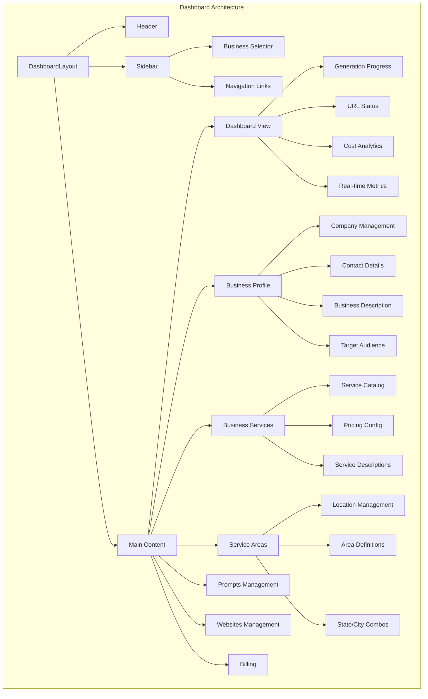

```mermaid
flowchart TD
subgraph "Dashboard Architecture"
DL[DashboardLayout] --> Header
DL --> Sidebar
DL --> MC[Main Content]

        Sidebar --> BS[Business Selector]
        Sidebar --> NL[Navigation Links]

        MC --> DV[Dashboard View]
        MC --> BP[Business Profile]
        MC --> BSV[Business Services]
        MC --> SA[Service Areas]
        MC --> PM[Prompts Management]
        MC --> WM[Websites Management]
        MC --> BL[Billing]

        DV --> GP[Generation Progress]
        DV --> US[URL Status]
        DV --> CA[Cost Analytics]
        DV --> RT[Real-time Metrics]

        BP --> CM[Company Management]
        BP --> CD[Contact Details]
        BP --> BD[Business Description]
        BP --> TA[Target Audience]

        BSV --> SC[Service Catalog]
        BSV --> PC[Pricing Config]
        BSV --> SD[Service Descriptions]

        SA --> LM[Location Management]
        SA --> AD[Area Definitions]
        SA --> SC2[State/City Combos]
    end
```
