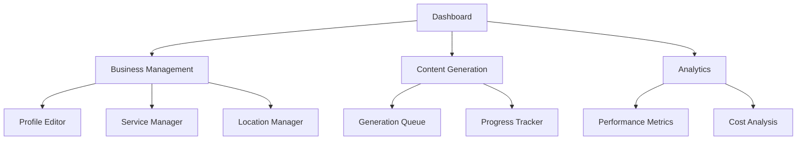
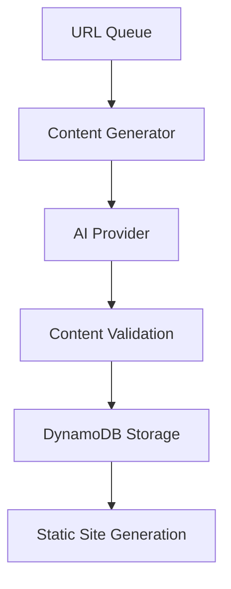

# Local SEO Website Generator

An enterprise-grade serverless system for generating location-based SEO websites using AI content generation, built on AWS infrastructure.

## Overview

The Local SEO Website Generator is a scalable system that automatically creates and manages location-based SEO websites. It combines AI content generation with sophisticated URL patterns to create thousands of targeted landing pages for local businesses.

## Core Features

- 🤖 Dual AI Provider Support (OpenAI GPT & Anthropic Claude)
- 📍 Location-aware content generation
- 🔄 Real-time generation progress tracking
- 📊 Business profile & service management
- 🗺️ Strategic SEO URL planning & generation
- 📱 Responsive page templates
- 📈 SEO performance monitoring

## Architecture

### Frontend Layer (React/TypeScript)



### Backend Services

- AWS Lambda Functions (Python 3.10+)
- DynamoDB for data persistence
- S3 for static hosting
- CloudFront for content delivery
- API Gateway with Cognito auth

## Business Profile Management

### Profile Schema

```typescript
interface BusinessProfile {
  business_id: string;
  business_name: string;
  business_website: string;
  business_industry: string;
  contact: {
    address1: string;
    city: string;
    state: string;
    zip: string;
  };
  description: {
    history: string;
    target_audience: string;
  };
  services: Array<{
    name: string;
    description: string;
    price: number;
  }>;
  service_areas: Array<{
    city: string;
    state: string;
  }>;
}
```

## Content Generation Pipeline

### 1. URL Pattern Generation

```python
def generate_url_patterns(business_service, location):
    patterns = [
        f"/{business_service.lower()}/{location.city}-{location.state}.html",
        f"/{location.city}/{business_service.lower()}-{location.state}.html",
        f"/{location.state}/{business_service.lower()}-{location.city}.html"
    ]
    return patterns
```

### 2. Content Generation Process



### 3. AI Content Generation

- Smart templating system
- Location-aware context injection
- SEO optimization layer
- Content quality validation

## DynamoDB Schema

### Business Details Table

Primary table for storing business information:

```typescript
{
  PK: "BUS#${business_id}",
  SK: "PROFILE#${business_id}",
  business_id: string,
  business_website: string,
  business_city: string,
  business_state: string,
  company_history_description: string,
  target_audience_description: string,
  business_industry: string,
  businessservices: List<Map>,
  serviceareas: List<Map>,
  seokeywords: List<Map>,
  social_profiles: Map<string, string>
}
```

### Webpage Content Table

Stores generated content for each URL:

```typescript
{
  PK: "BUS#${business_id}",
  SK: "URL#${url_id}",
  url: string,
  content: string,
  metaDescription: string,
  title: string,
  pageType: "local-seo" | "service-area" | "business-service" | "top-layer-page",
  business_service?: string,
  service_area?: string
}
```

## Generation Types

1. **Local SEO Pages**

   - Location-specific landing pages
   - Service + Location combinations
   - Optimized for local search

2. **Service Area Pages**

   - Coverage area content
   - Regional service descriptions
   - Location-based trust signals

3. **Business Service Pages**

   - Service-specific content
   - Detailed service descriptions
   - Pricing and features

4. **Top Layer Pages**
   - About Us, Contact, etc.
   - Core business information
   - Brand messaging

## Deployment

### Prerequisites

- Node.js 18+
- Python 3.10+
- AWS CLI configured
- OpenAI API key
- Anthropic API key

### Installation

```bash
# Install dependencies
npm install

# Configure AWS
aws configure

# Deploy infrastructure
npm run deploy

# Start development
npm run dev
```

## Development

### Local Setup

1. Clone repository
2. Install dependencies
3. Set up environment variables
4. Configure AWS credentials

### Environment Variables

```bash
OPENAI_API_KEY=sk-xxx
ANTHROPIC_API_KEY=sk-xxx
AWS_REGION=us-east-1
DYNAMODB_TABLE=mb_business_details_table
```

## Monitoring & Analytics

- Generation progress tracking
- Content quality metrics
- SEO performance monitoring
- Cost analysis dashboard

## Security

- AWS Cognito authentication
- IAM role-based access
- API key management
- Data encryption at rest

## Future Enhancements

- Multi-language support
- Advanced SEO templates
- A/B testing capabilities
- Enhanced analytics
- Custom page builders

## Documentation

For detailed documentation on specific components:

- [Business Profile Schema](./docs/schema/business-profile-schema.md)
- [Webpage Content Schema](./docs/schema/webpage-content-schema.md)
- [API Documentation](./docs/api/README.md)

## Contributing

1. Fork the repository
2. Create feature branch
3. Commit changes
4. Submit pull request

## License

This project is proprietary and confidential.
