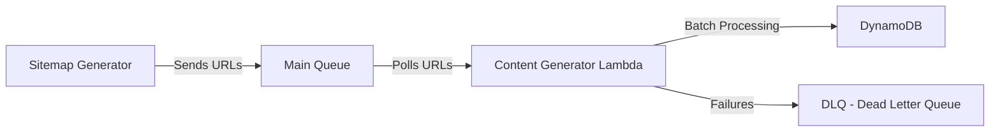

```mermaid
flowchart LR
    A[Sitemap Generator] -->|Sends URLs| B[Main Queue]
    B -->|Polls URLs| C[Content Generator Lambda]
    C -->|Batch Processing| D[DynamoDB]
    C -->|Failures| E[DLQ - Dead Letter Queue]
```
