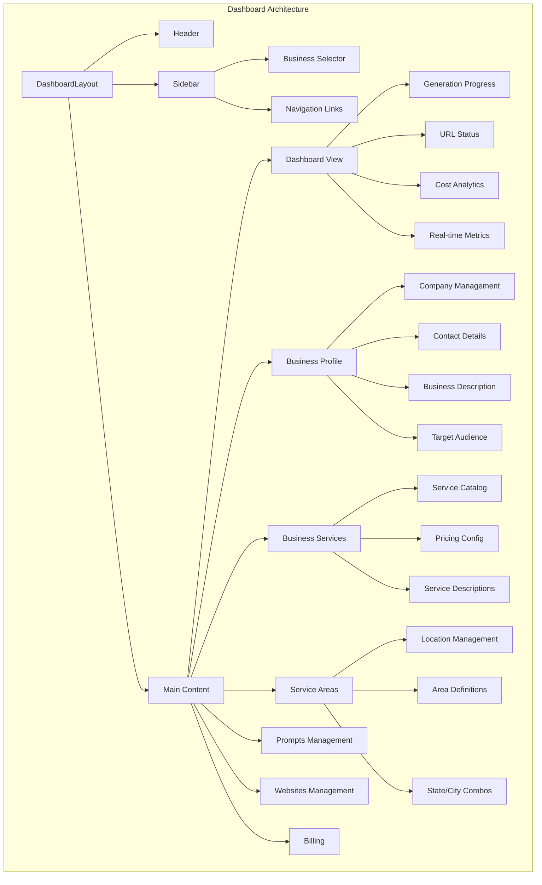
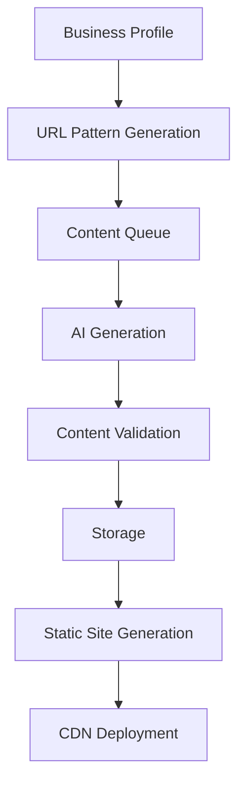
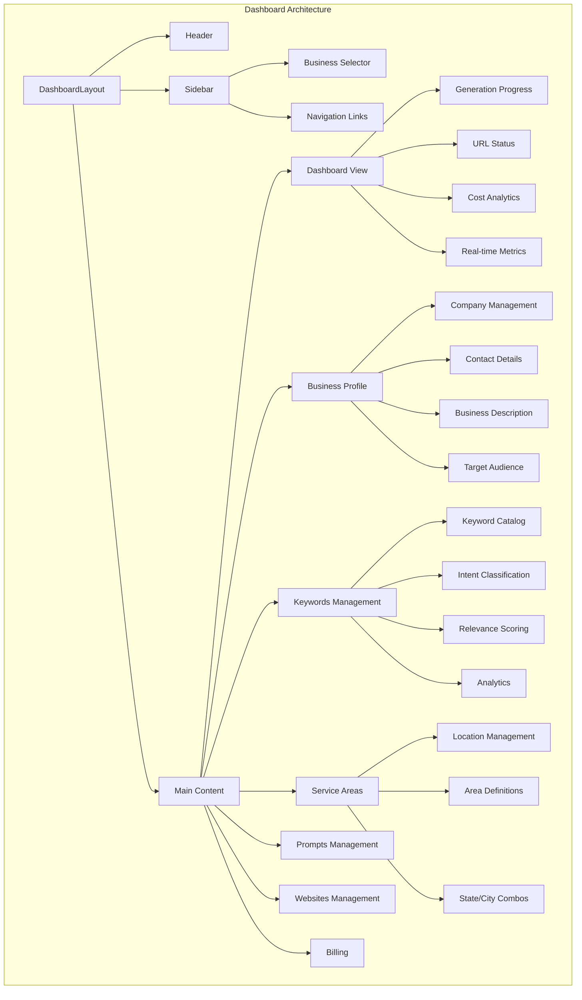

# Local SEO Website Generator

A comprehensive serverless system for generating location-based SEO websites using AI content generation, built on AWS infrastructure.

## Table of Contents

1. [Overview](#overview)
2. [Core Features](#core-features)
3. [Dashboard Architecture](#dashboard-architecture)
4. [Technical Implementation](#technical-implementation)
5. [Content Generation System](#content-generation-system)
6. [Data Architecture](#data-architecture)
7. [API Integration](#api-integration)
8. [Setup & Deployment](#setup--deployment)
9. [Development Guide](#development-guide)
10. [Security](#security)
11. [Monitoring & Analytics](#monitoring--analytics)
12. [Future Roadmap](#future-roadmap)

## Overview

The Local SEO Website Generator is an enterprise-grade platform that automates the creation and management of location-based SEO websites. This system combines advanced AI content generation with strategic URL planning to create thousands of targeted landing pages for local businesses, maximizing their digital presence across multiple service areas.

## Core Features

### Primary Capabilities

- 🤖 Dual AI Content Generation

  - OpenAI GPT integration
  - Anthropic Claude integration
  - Smart content templating
  - Quality validation systems

- 📍 Location Intelligence

  - Service area targeting
  - Geographic content customization
  - Local keyword optimization
  - Regional business focus

- 🎯 SEO Strategy

  - Strategic URL pattern generation
  - Keyword optimization
  - Location-based content planning
  - Conversion optimization

- 📊 Business Management
  - Comprehensive profile management
  - Service catalog administration
  - Location targeting
  - Performance analytics

### Dashboard Features

- Real-time generation tracking
- Cost analytics and monitoring
- Business profile management
- Service area configuration
- URL status monitoring
- Progress visualization

## Dashboard Architecture



### Component Details

#### Dashboard View (Dashboard.tsx)

- Generation status monitoring
- Real-time progress tracking
- Cost analysis display
- URL generation metrics
- Service area coverage visualization

#### Business Profile (BusinessProfile.tsx)

- Company information management
- Contact details administration
- Business description editor
- Target audience definition
- Social media integration

#### Business Services (BusinessServices.tsx)

- Service catalog management
- Pricing configuration
- Service description editor
- Category organization
- Service area mapping

#### Service Areas (ServiceAreas.tsx)

- Location management
- Coverage area definition
- State/city combination management
- Geographic targeting
- Service radius configuration

#### Prompts Management

- AI prompt template management
- Content style configuration
- Tone and voice settings
- Keywords integration
- Custom prompt creation

#### Websites Management

- Website portfolio overview
- Domain management
- Deployment status
- Performance metrics
- SEO analytics

#### Billing

- Cost tracking
- Usage analytics
- Invoice management
- Subscription control
- Resource allocation

## Technical Implementation

### Frontend Stack

```typescript
// Core Technologies
- React 18.2.0
- TypeScript 5.6.3
- TailwindCSS 3.4.1
- shadcn/ui components

// State Management
- React Context API
- Custom Hooks

// Routing
- React Router DOM 6.27.0

// HTTP Client
- Axios 1.7.7
```

### Backend Services

```typescript
// AWS Infrastructure
- Lambda (Python 3.10+)
- DynamoDB
- S3
- CloudFront
- API Gateway
- Cognito Authentication

// AI Services
- OpenAI GPT API
- Anthropic Claude API
```

## Content Generation System

### URL Pattern Generation

```python
def generate_url_patterns(business_profile, service_area):
    """
    Generates strategic URL patterns for SEO targeting
    """
    patterns = {
        'service_area': f"/{service_area.city}-{service_area.state}.html",
        'service_specific': f"/{business_service}/{service_area.city}-{service_area.state}.html",
        'location_specific': f"/{service_area.city}/{business_service}-{service_area.state}.html"
    }
    return patterns
```

### Generation Pipeline



### Content Types

1. Service Pages

   - Service descriptions
   - Pricing information
   - Benefits and features
   - Call-to-action elements

2. Location Pages

   - Area-specific content
   - Local business information
   - Geographic targeting
   - Community focus

3. Combined Pages
   - Service + Location
   - Industry + Area
   - Specialty + Region

## Data Architecture

### Business Profile Schema

```typescript
interface BusinessProfile {
  // Core Identity
  id: string;
  name: string;
  website: string;
  industry: string;

  // Location Information
  location: {
    addressLine1: string;
    addressLine2?: string;
    city: string;
    state: string;
    zipCode: string;
  };

  // Contact Information
  contact: {
    phone: string;
  };

  // Business Details
  description: {
    history: string;
    audience: string;
  };

  // Services Configuration
  services: Array<{
    name: string;
    description: string;
    price: string;
  }>;

  // Service Areas Configuration
  serviceAreas: Array<{
    city: string;
    state: string;
  }>;

  seoKeywords: string[];

  // Metadata
  metadata: {
    createdAt: string;
    updatedAt: string;
    version: number;
    status: "active" | "inactive" | "pending";
  };
}
```

### DynamoDB Tables

#### Business Details Table

```typescript
{
  // Primary Key
  id: { S: string },                    // Primary partition key

  // Core Business Information
  name: { S: string },                  // Business name
  website: { S: string },               // Primary website URL
  industry: { S: string },              // Business industry/category

  // Location Information
  location: {
    M: {
      addressLine1: { S: string },           // Primary address
      addressLine2: { S: string },              // Secondary address
      city: { S: string },              // Primary city
      state: { S: string },             // Primary state
      zipCode: { S: string }            // ZIP/Postal code
    }
  },

  // Business Details
  description: {
    M: {
      history: { S: string },           // Company history/about
      audience: { S: string }           // Target audience details
    }
  },

  // Services Configuration
  services: {
    L: [{
      M: {
        name: { S: string },            // Service name
        description: { S: string },      // Service description
        price: { S: string },           // Service price/range
      }
    }]
  },

  // Service Areas Configuration
  serviceAreas: {
    L: [{
      M: {
        city: { S: string },            // Service city
        state: { S: string },           // Service state
      }
    }]
  },

  seoKeywords: {
    L: [
        { S: string }    // Simple array of keyword strings
    ]
},

  // Metadata
  metadata: {
    M: {
      createdAt: { S: string },         // Creation timestamp
      updatedAt: { S: string },         // Last update timestamp
      version: { N: number },           // Schema version
      status: { S: string }             // Account status
    }
  }
}
```

#### Generated Content Table

```typescript
{
  PK: { S: "BUS#${business_id}" },
  SK: { S: "URL#${url_id}" },

  // Content
  url: { S: string },
  content: { S: string },
  metaDescription: { S: string },
  title: { S: string },

  // Classification
  pageType: {
    S: "local-seo" | "service-area" | "business-service" | "top-layer-page"
  },

  // Relations
  business_service?: { S: string },
  service_area?: { S: string },

  // Metadata
  created_at: { S: string },
  updated_at: { S: string },
  version: { N: number }
}
```

## API Integration

### API Endpoints

```typescript
const API_ENDPOINTS = {
  // Business Management
  getBusinessProfile: "/business/:id/profile",
  updateBusinessProfile: "/business/:id/profile",
  getBusinessServices: "/business/:id/services",
  updateBusinessServices: "/business/:id/services",

  // Generation
  generateUrls: "/generate/:id/urls",
  getGenerationProgress: "/generate/:id/progress",
  getGenerationStatus: "/generate/:id/status",

  // Analytics
  getAiCosts: "/analytics/:id/costs",
  getPerformanceMetrics: "/analytics/:id/metrics",
};
```

### Integration Example

```typescript
// API Service
export const ApiService = {
  async getBusinessProfile(businessId: string): Promise<BusinessProfile> {
    try {
      const response = await apiClient.get(`/business-profile/${businessId}`);
      return response.data;
    } catch (error) {
      throw new AppError(
        error.response?.data?.message || "Failed to fetch profile",
        "PROFILE_FETCH_ERROR",
        error.response?.status || 500
      );
    }
  },

  // Additional methods...
};
```

## Setup & Deployment

### Prerequisites

```bash
# Required Software
Node.js >= 18.0.0
Python >= 3.10.0
AWS CLI >= 2.0.0

# Required Keys
AWS_ACCESS_KEY_ID=xxx
AWS_SECRET_ACCESS_KEY=xxx
OPENAI_API_KEY=sk-xxx
ANTHROPIC_API_KEY=sk-xxx
```

### Installation

```bash
# Install dependencies
npm install

# Configure AWS
aws configure

# Set up environment
cp .env.example .env
```

### Development

```bash
# Start development server
npm run dev

# Type checking
npm run type-check

# Build for production
npm run build
```

### Production Deployment

```bash
# Build production assets
npm run build

# Deploy to AWS
npm run deploy
```

## Development Guide

### Project Structure

```
/src
  /components
    /dashboard
      Dashboard.tsx
      BusinessProfile.tsx
      BusinessServices.tsx
      ServiceAreas.tsx
      Sidebar.tsx
      Header.tsx
      index.ts
    /ui
      Button.tsx
      Card.tsx
      Input.tsx
      ProgressBar.tsx
      Select.tsx
      Table.tsx
      Toast.tsx
      UseToast.tsx
  /contexts
    BusinessContext.tsx
  /lib
    api.ts
    utils.ts
  /styles
    globals.css
  /types
    global.d.ts
```

### Component Development

```typescript
// Component Template
import React from "react";
import { useBusinessContext } from "@/contexts/BusinessContext";
import { Card, Button } from "@/components/ui";

interface ComponentProps {
  // Props definition
}

export const Component: React.FC<ComponentProps> = () => {
  // Implementation
};
```

### Style Guide

```typescript
// Naming Conventions
components / // React components
  contexts / // React contexts
  lib / // Utility functions
  styles / // Global styles
  types / // TypeScript definitions
  // File Naming
  PascalCase.tsx; // React components
camelCase.ts; // Utility files
```

## Security

### Authentication

- AWS Cognito user pools
- JWT token authentication
- Role-based access control

### Data Protection

- HTTPS encryption
- Data encryption at rest
- Secure environment variables

### API Security

- API Gateway authorization
- Request validation
- Rate limiting

## Monitoring & Analytics

### Performance Monitoring

- Generation success rates
- API response times
- Error tracking
- Resource utilization

### Cost Analysis

- AI API usage
- AWS resource costs
- Per-page generation costs
- Monthly trending

### SEO Metrics

- Page generation status
- Content quality scores
- Keyword density
- Meta tag validation

## Future Roadmap

### Planned Features

1. Multi-language Support

   - Content translation
   - Language-specific SEO
   - Regional targeting

2. Advanced Analytics

   - SEO performance tracking
   - Conversion analytics
   - ROI calculations

3. Enhanced Automation

   - Automated content updates
   - Schedule-based generation
   - Content freshness monitoring

4. Mobile Applications

   - iOS app development
   - Android app development
   - Mobile-first features

5. Integration Expansions
   - Additional AI providers
   - CMS integrations
   - Analytics platforms

## Contributing

### Development Process

1. Fork repository
2. Create feature branch
3. Implement changes
4. Add tests
5. Submit pull request

### Code Standards

- ESLint configuration
- Prettier formatting
- TypeScript strict mode
- Unit test coverage

## License

This project is proprietary and confidential. All rights reserved.

---

For support or inquiries, contact the development team.


