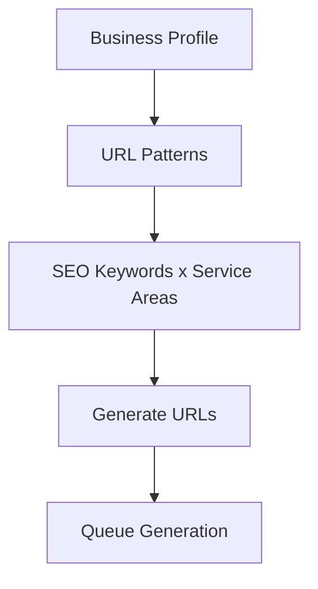
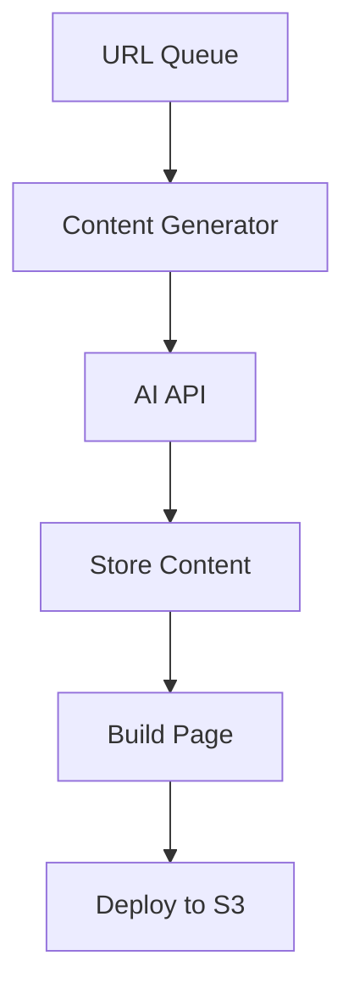
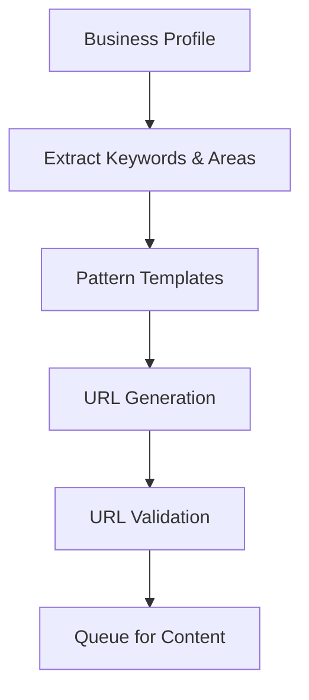
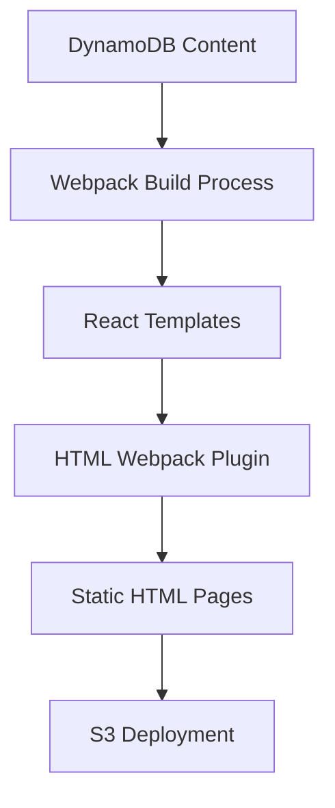

# Local SEO Website Generator v2

A scalable serverless system for generating location-based SEO websites using AI content generation.

## Enhanced Architecture Overview

### Frontend Layer

- React/TypeScript dashboard
- TailwindCSS + shadcn/ui components
- Real-time progress tracking
- Business profile management interface

### Content Generation Layer

- Dual AI Provider Support:
  - OpenAI GPT-4
  - Anthropic Claude
- Smart content templating
- SEO optimization engine
- Content quality validation

### Infrastructure

- AWS Lambda functions (Python 3.x)
- Client-isolated DynamoDB tables
- CloudFront CDN + S3 hosting
- API Gateway with Cognito auth

## Data Architecture

### Business Profile Schema

```json
{
  "PK": {"S": "BUS#[business-id]"},
  "SK": {"S": "PROFILE#[business-id]"},
  "business_id": {"S": "string"},
  "business_name": {"S": "string"},
  "contact": {
    "M": {
      "address1": {"S": "string"},
      "city": {"S": "string"},
      "state": {"S": "string"},
      "zip": {"S": "string"}
    }
  },
  "seo_keywords": {"L": [...]},
  "service_areas": {"L": [...]},
  "url_patterns": {"L": [...]}
}
```

## URL Generation Process



## Content Generation Flow



### Infrastructure

- AWS Lambda Functions
  - URL Generator (`/lambdas/url_generator.py`)
  - Content Generator (`/lambdas/content_generator.py`)
  - Page Builder (`/lambdas/page_builder.py`)
- DynamoDB Tables
  - Business Profiles (`mb_business_profiles`)
  - URL Patterns (`mb_url_patterns`)
  - Generated Content (`[client]_content`)

### Project Structure

```bash
/local-seo-generator
├── frontend/                    # React TypeScript Frontend
│   ├── src/
│   │   ├── components/         # React Components
│   │   │   ├── ui/            # Reusable UI Components
│   │   │   │   ├── Button.tsx # Shadcn UI Button
│   │   │   │   ├── Card.tsx  # Content Display Cards
│   │   │   │   ├── Input.tsx # Form Inputs
│   │   │   │   ├── ProgressBar.tsx # Generation Progress
│   │   │   │   ├── ScrollArea.tsx  # Scrollable Content
│   │   │   │   ├── Select.tsx # Dropdown Menus
│   │   │   │   ├── Table.tsx  # Data Tables
│   │   │   │   ├── Toast.tsx  # Notifications
│   │   │   │   └── UseToast.tsx # Toast Hook
│   │   │   └── dashboard/     # Dashboard Components
│   │   │       ├── BusinessProfile.tsx # Profile Management
│   │   │       ├── BusinessServices.tsx # Services Management
│   │   │       ├── Dashboard.tsx       # Main Dashboard
│   │   │       ├── DashboardLayout.tsx # Layout Container
│   │   │       ├── Header.tsx         # Dashboard Header
│   │   │       ├── ServiceAreas.tsx   # Areas Management
│   │   │       ├── Sidebar.tsx        # Navigation Sidebar
│   │   │       └── index.ts           # Component Exports
│   │   ├── contexts/          # React Contexts
│   │   │   └── BusinessContext.tsx # Business Data Context
│   │   ├── lib/              # Utility Functions
│   │   │   ├── api.ts       # API Integration
│   │   │   └── utils.ts     # Helper Functions
│   │   ├── styles/          # Global Styles
│   │   │   └── globals.css  # TailwindCSS Imports
│   │   └── types/           # TypeScript Types
│   │       ├── global.d.ts  # Global Type Definitions
│   │       └── dotenv-webpack.d.ts # Environment Types
│   ├── public/              # Static Assets
│   └── webpack/             # Build Configuration
│       ├── webpack.common.ts # Shared Config
│       ├── webpack.dev.ts   # Development Config
│       └── webpack.prod.ts  # Production Config
├── backend/                 # Serverless Backend
│   ├── lambdas/            # Lambda Functions
│   │   ├── url_generator/  # URL Generation Service
│   │   ├── content_generator/ # AI Content Generation
│   │   └── page_builder/   # Static Page Builder
│   ├── lib/               # Shared Backend Utils
│   └── templates/         # Page Templates
├── infrastructure/        # IaC Resources
│   ├── dynamodb/         # DynamoDB Tables
│   │   ├── business_profiles.tf # Profile Table
│   │   ├── url_patterns.tf     # URL Pattern Table
│   │   └── webpage_content.tf  # Content Tables
│   ├── lambda/           # Lambda Resources
│   └── s3/              # S3 Bucket Config
├── docs/                # Documentation
│   ├── schema/          # Data Schemas
│   │   ├── business-profile-schema.md
│   │   └── webpage-content-schema.md
│   └── api/            # API Documentation
├── tests/              # Test Suites
│   ├── frontend/       # Frontend Tests
│   └── backend/        # Backend Tests
├── package.json        # NPM Configuration
├── serverless.yml      # Serverless Framework Config
├── tsconfig.json       # TypeScript Config
└── README.md          # Project Documentation
```

### Quick Start

```bash
# Install dependencies
npm install

# Configure AWS credentials
aws configure

# Deploy infrastructure
serverless deploy

# Start development server
npm run dev
```

### Monitoring

- CloudWatch Dashboard
- Generation Progress
- Error Tracking
- Cost Analysis

## URL Generation Process

### 1. Input Components

- Business Profile data
- SEO Keywords list (100 keywords)
- Service Areas list (42 locations)
- URL pattern templates

### 2. Flow



### 3. Example Generation

```javascript
# Input
keyword = "weed-dispensary"
location = "adams-morgan"
state = "washington-dc"
pattern = "/${keyword}/${location}-${state}.html"

# Output
url = "/weed-dispensary/adams-morgan-washington-dc.html"
```

### 4. Pattern Types

```javascript
patterns = [
  "/${keyword}/${location}-${state}.html",
  "/${location}/${keyword}-${state}.html",
  "/${state}/${keyword}-${location}.html",
];
```

### 5. URL Structure Components

- Domain: streetlawyerservices.com
- Keyword Segment: weed-dispensary
- Location Segment: adams-morgan
- State Segment: washington-dc
- Extension: .html

### 6. Scale

- 100 keywords × 42 locations = 4,200 base URLs
- Multiple patterns per combination
- Additional service/product variations

The Lambda function will process these combinations in batches, validating and queueing them for content generation.

## Static Page Generation Strategy

### Webpack-Based Generation Pipeline



## Generation Process

### 1. Content Preparation

- Pull content from DynamoDB tables
- Group by URL patterns
- Prepare SEO metadata
- Structure content for templates

### 2. Webpack Configuration

```typescript
// webpack.static.ts
{
  entry: {
    // Dynamic entries for each page
    [pageSlug]: generateEntryPoint(pageData)
  },
  plugins: [
    // Generate HTML for each page
    new HtmlWebpackPlugin({
      template: 'src/templates/page.tsx',
      filename: `${pageSlug}.html`,
      chunks: [pageSlug],
      templateParameters: pageData
    })
  ]
}
```

### 3. React Template Structure

```typescript
// src/templates/page.tsx
interface PageProps {
  keyword: string;
  location: string;
  content: string;
  meta: {
    title: string;
    description: string;
  };
}

const PageTemplate: React.FC<PageProps> = ({
  keyword,
  location,
  content,
  meta,
}) => (
  <html>
    <head>
      <title>{meta.title}</title>
      <meta name="description" content={meta.description} />
    </head>
    <body>
      <main dangerouslySetInnerHTML={{ __html: content }} />
    </body>
  </html>
);
```

### 4. Build Process

```bash
# Generate all pages
npm run build:static

# Output: ~/dist/
# - /weed-dispensary/adams-morgan-washington-dc.html
# - /cannabis-store/dupont-circle-washington-dc.html
# ... (40,000+ pages)
```

## Optimization Strategies

### 1. Chunking

- Common components extracted
- Shared assets optimization
- Dynamic imports for large sections

### Asset Management

- Images optimized and CDN-distributed
- CSS/JS minification
- Gzip compression

### Build Performance

- Parallel processing
- Incremental builds
- Cache utilization

### Deployment

- CloudFront distribution
- S3 bucket organization
- Invalidation strategies

### Monitoring & Analytics

- Build times tracking
- Page size monitoring
- Load time analytics
- SEO performance metrics

This approach allows for:

- Scalable generation of 40,000+ pages
- Consistent templating
- Optimized build process
- Efficient content distribution

## Dashboard Menu Tabs

- Dashboard
- Business Profile
- Business Services
- Service Areas
- Prompts
- Websites
- Billing

### Dashboard Screen

Shows the dashboard of the current progression of local website AI Generation.

#### Real-time Metrics

- Pages Generated: progress/total
- Generation Speed: pages/hour
- Queue Status: pending/processing/complete

#### Analytics Dashboard

- Content Generation Stats
- Build Performance
- Cost Tracking

#### State Management

```typescript
interface DashboardState {
  activeTab: string;
  generationProgress: GenerationStatus;
  notifications: Notification[];
  userPreferences: UserSettings;
}
```

### Business Profile Screen

Shows the business profile and makes it editable.

#### Profile Management

```typescript
interface BusinessProfile {
  id: string;
  name: string;
  industry: string;
  contact: ContactInfo;
  branding: BrandAssets;
}
```

- Real-time DynamoDB sync
- Validation rules

### Business Services Screen

A screen that lists and manages the business services and saves within DynamoDB table.

#### Service Management

- CRUD operations
- Category organization

### Service Area Screen

A screen that lists and manages the service areas and saves within DynamoDB table.

- Location Management

### Prompts Screen

Shows the prompts that we are using, and make it editable.

#### AI Prompt Engineering

- Template management
- Variable insertion

### Websites Screen

Shows all the websites that are associated with that business. A business can have multiple supporting SEO websites as part of their SEO strategy to their main website.

#### Website Management

### Billing Screen

Shows the billing costs for each website.

#### Cost Management

- Usage breakdown
- Cost forecasting
- Resource allocation
- Billing history
