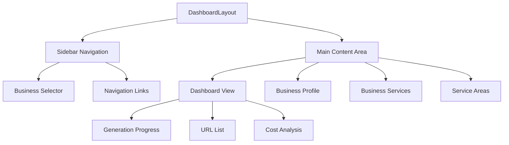
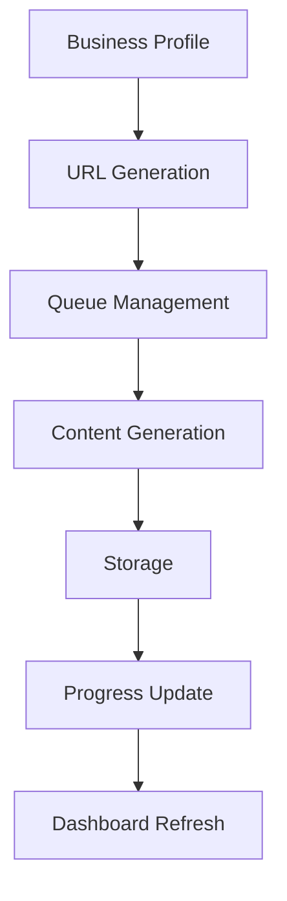

# Local SEO Website Generator

An enterprise-grade serverless system for generating location-based SEO websites using AI content generation, built on AWS infrastructure.

## Overview

The Local SEO Website Generator is a scalable system that automatically creates and manages location-based SEO websites. It combines AI content generation with sophisticated URL patterns to create thousands of targeted landing pages for local businesses.

## Core Features

- 🤖 Dual AI Provider Support (OpenAI GPT & Anthropic Claude)
- 📍 Location-aware content generation
- 🔄 Real-time progress tracking dashboard
- 🎯 Strategic SEO URL planning & generation
- 💼 Business profile & service management
- 📱 Responsive admin interface
- 📊 Cost analytics & monitoring

## Dashboard Architecture

### Frontend Layer


### Key Components

#### Dashboard View (`Dashboard.tsx`)
- Real-time generation progress tracking
- URL generation status monitoring
- AI cost analysis display
- Service/Location metrics

#### Business Profile (`BusinessProfile.tsx`)
- Company information management
- Contact details
- Business description
- Target audience definition

#### Business Services (`BusinessServices.tsx`)
- Service catalog management
- Pricing configuration
- Service descriptions
- CRUD operations

#### Service Areas (`ServiceAreas.tsx`)
- Location management
- Service area definition
- State/city combinations

## Technical Stack

### Frontend
- React 18
- TypeScript
- TailwindCSS
- shadcn/ui components
- React Router DOM
- Axios

### Backend Services
- AWS Lambda Functions (Python 3.10+)
- DynamoDB for data persistence
- S3 for static hosting
- CloudFront for content delivery
- API Gateway with Cognito auth

## Content Generation Process

### 1. URL Pattern Generation
The system creates targeted URL patterns based on:
- Business services
- Service areas
- State/city combinations
- SEO keywords

### 2. Generation Pipeline


## Data Architecture

### Business Profile Schema
```typescript
interface BusinessProfile {
  business_id: string;
  business_name: string;
  business_website: string;
  business_industry: string;
  contact: {
    phone: string;
    email: string;
    address1: string;
    address2?: string;
    city: string;
    state: string;
    zip: string;
  };
  description: {
    history: string;
    target_audience: string;
  };
  services: Array<{
    id: string;
    name: string;
    description: string;
    price: string;
  }>;
  service_areas: Array<{
    id: string;
    location: string;
  }>;
}
```

### DynamoDB Tables

#### Business Details Table
```typescript
{
  PK: "BUS#${business_id}",
  SK: "PROFILE#${business_id}",
  business_id: string;
  business_website: string;
  business_city: string;
  business_state: string;
  company_history_description: string;
  target_audience_description: string;
  business_industry: string;
  businessservices: List<Map>;
  serviceareas: List<Map>;
  seokeywords: List<Map>;
  social_profiles: Map<string, string>;
}
```

#### Generated Content Table
```typescript
{
  url: { S: string },
  business_id: { S: string },
  content: { S: string },
  metaDescription: { S: string },
  title: { S: string },
  pageType: { S: "local-seo" | "service-area" | "business-service" | "top-layer-page" },
  business_service?: { S: string },
  service_area?: { S: string }
}
```

## Setup & Development

### Prerequisites
```bash
# Required versions
Node.js >= 18
Python >= 3.10
AWS CLI configured
```

### Installation
```bash
# Install dependencies
npm install

# Start development server
npm run dev

# Build for production
npm run build
```

### Environment Variables
```bash
REACT_APP_API_BASE_URL=https://your-api-gateway-url
OPENAI_API_KEY=sk-xxx
ANTHROPIC_API_KEY=sk-xxx
AWS_REGION=us-east-1
```

## Project Structure
```
/src
  /components
    /dashboard
      Dashboard.tsx       # Main dashboard view
      BusinessProfile.tsx # Profile management
      BusinessServices.tsx # Services management
      ServiceAreas.tsx    # Location management
      Sidebar.tsx        # Navigation
      Header.tsx         # Top bar
    /ui                  # Reusable UI components
  /contexts
    BusinessContext.tsx  # Business state management
  /lib
    api.ts              # API integration
    utils.ts            # Utility functions
  /styles
    globals.css         # Global styles
```

## API Integration

The dashboard communicates with AWS Lambda functions through API Gateway:
- Business profile management
- Service/location updates
- Generation progress tracking
- Cost analysis

## Monitoring & Analytics

### Progress Tracking
- Real-time generation status
- URL completion monitoring
- Error tracking
- Page statuses

### Cost Analysis
- OpenAI usage costs
- Claude API costs
- Total token consumption
- Cost per page metrics

## Security

- AWS Cognito authentication
- Protected API endpoints
- Secure environment variables
- CORS configuration

## Future Enhancements

- 🌐 Multi-language support
- 📊 Advanced analytics dashboard
- 🔄 Batch operation capabilities
- 📱 Mobile app version
- 🔍 SEO performance tracking

## Contributing

1. Fork the repository
2. Create feature branch
3. Commit changes
4. Submit pull request

## License

This project is proprietary and confidential.
